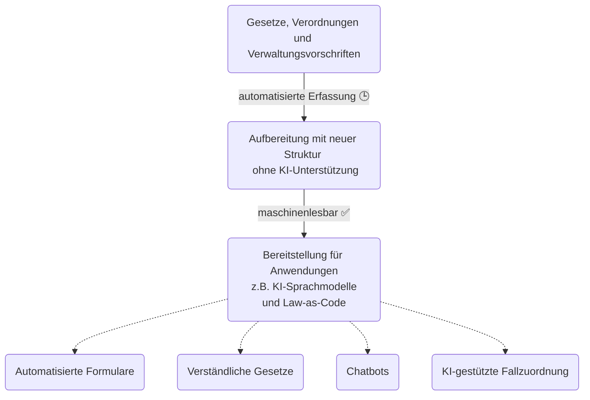

```mermaid
flowchart TD
    A(Gesetze, Verordnungen und <br>Verwaltungsvorschriften) -->|automatisierte Erfassung 🕒| B(Aufbereitung mit neuer Struktur <br> ohne KI-Unterstützung)
    B --> |maschinenlesbar ✅| C(Bereitstellung für Anwendungen<br>z.B. KI-Sprachmodelle<br>und Law-as-Code)
    C -.-> D(Automatisierte Formulare)
    C -.-> E(Verständliche Gesetze)
    C -.-> F(Chatbots)
    C -.-> G(KI-gestützte Fallzuordnung)
```
