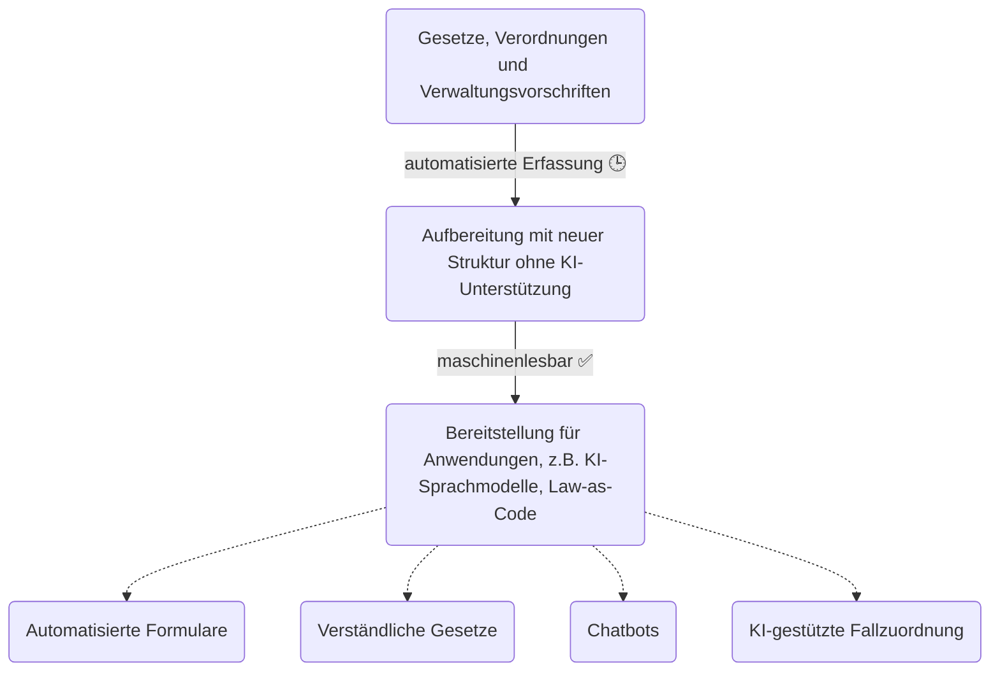

```mermaid
flowchart TD
    A(Gesetze, Verordnungen und Verwaltungsvorschriften) -->|automatisierte Erfassung 🕒| B(Aufbereitung mit neuer Struktur ohne KI-Unterstützung)
    B --> |maschinenlesbar ✅| C(Bereitstellung für Anwendungen, z.B. KI-Sprachmodelle, Law-as-Code)
    C -.-> D(Automatisierte Formulare)
    C -.-> E(Verständliche Gesetze)
    C -.-> F(Chatbots)
    C -.-> G(KI-gestützte Fallzuordnung)
```
