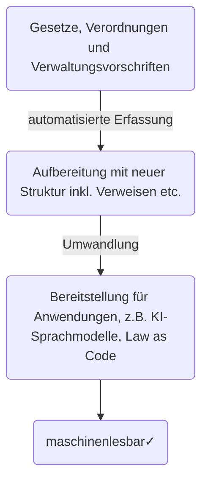

```mermaid
flowchart TD
    A(Gesetze, Verordnungen und Verwaltungsvorschriften) -->|automatisierte Erfassung| B(Aufbereitung mit neuer Struktur inkl. Verweisen etc.)
    B --> |Umwandlung| C(Bereitstellung für Anwendungen, z.B. KI-Sprachmodelle, Law as Code)
    C --> D(maschinenlesbar✓)
```
